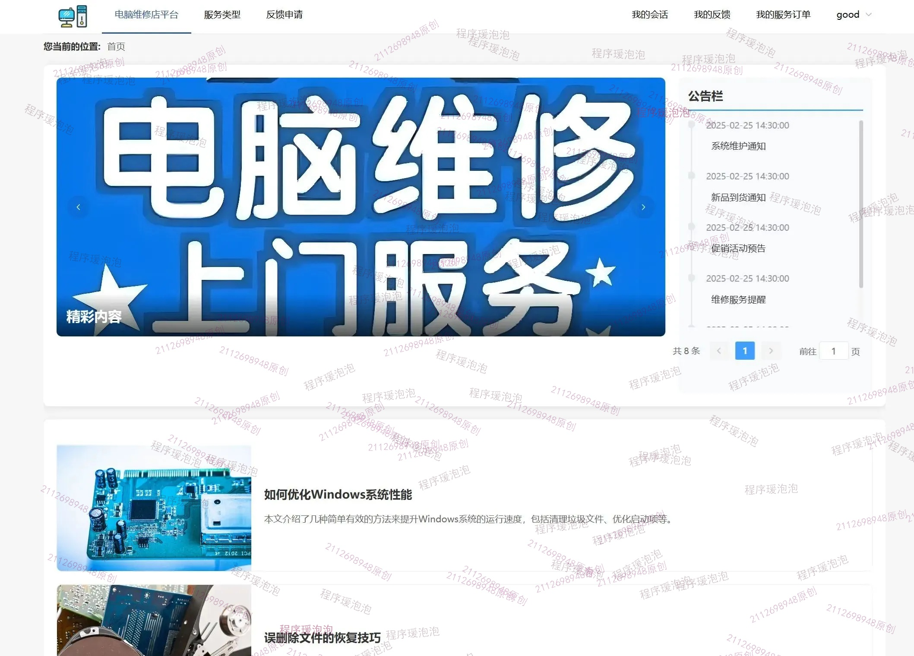
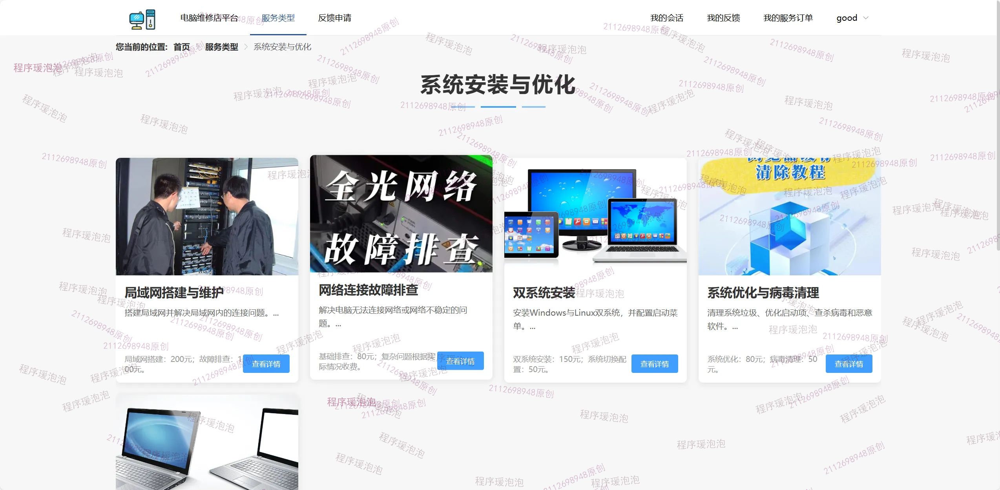
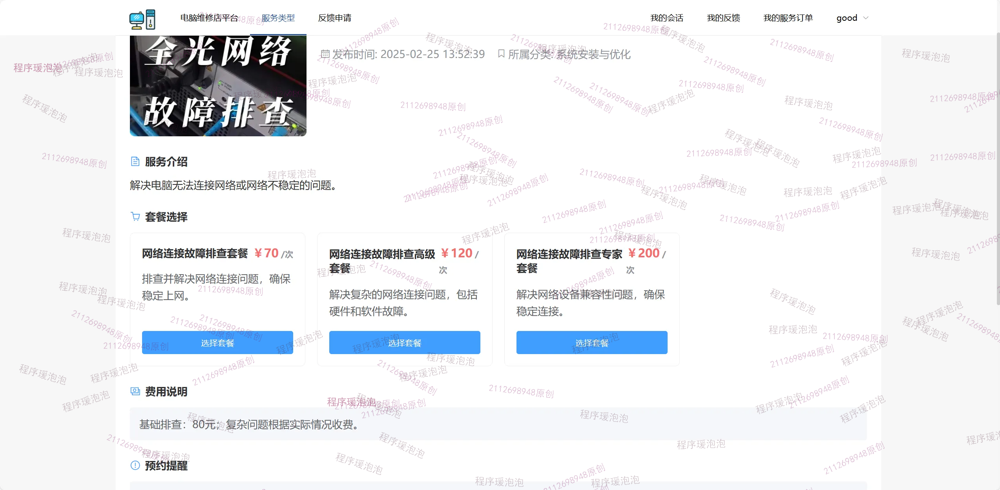
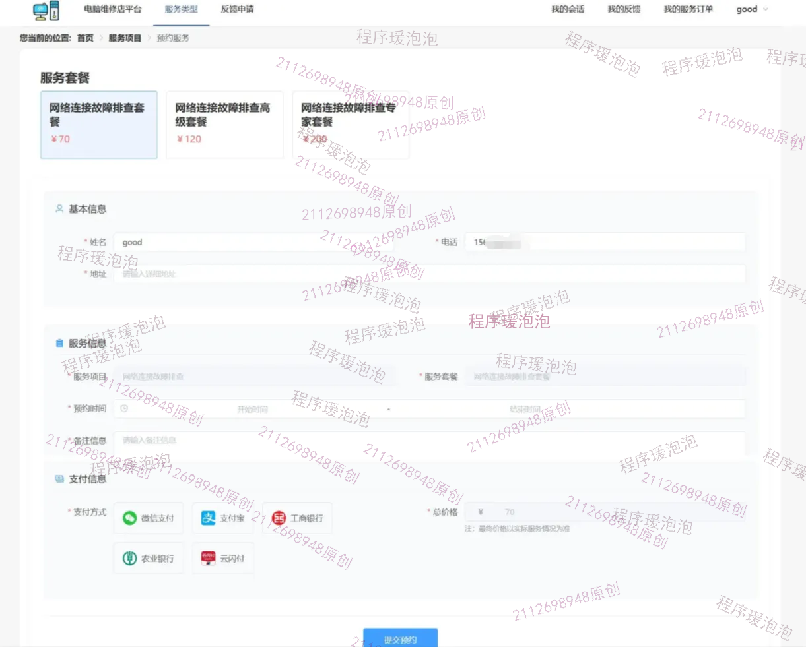
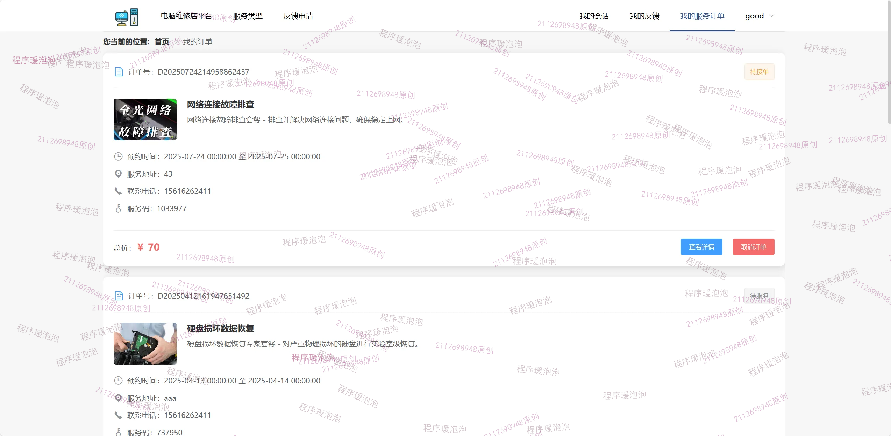
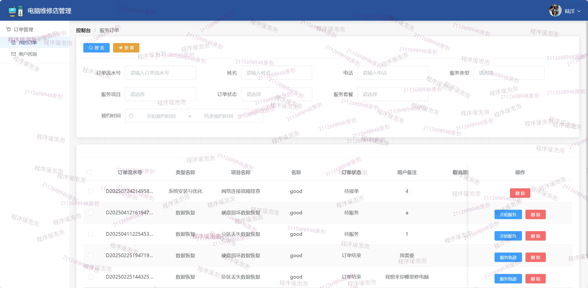
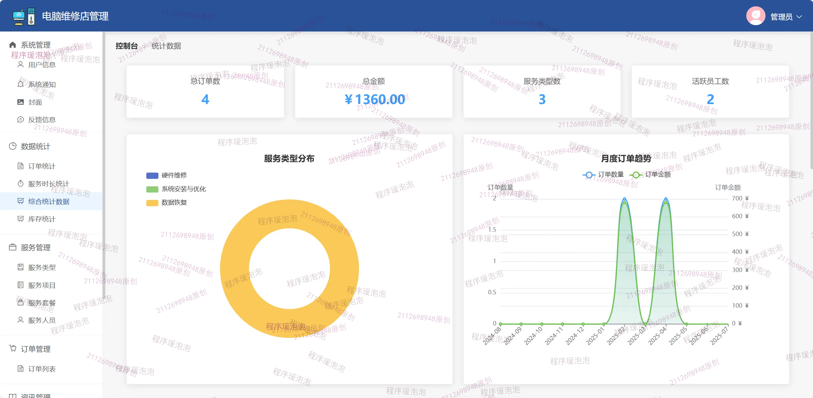
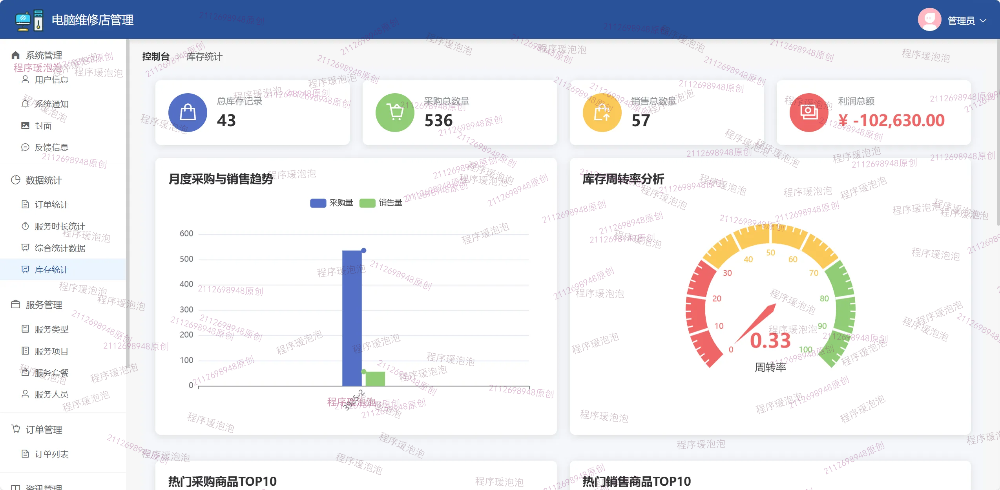

# computerservice
电脑店维修管理系统  亮点：WebSocket实时聊天、Echarts图形化分析；角色：用户、服务人员、管理员；
所有源码均本人开发，项目是前后端分离的，所有的项目都具备了完整的业务逻辑，不仅仅局限于基础的增删改查（CRUD）操作，系统亮点众多。

本文注重于计算机毕业设计选题指导，列出题目均有源码， 大家可以去【公众号】(毕业终点站)获取或者加我【qq】(2112698948)提意见(别忘记Star哟)。备注：git

声明：仅用于学习使用，请勿用于任何商业行为！

1.系统非商用，非开源，非无偿。

2.由本人开发，如需源码，请联系以下方式，qq:2112698948。

3.项目有很多，并未全部上传，如果未找到想要的，可直接咨询。

# 电脑店维修管理系统

> 毕业设计 / 课程设计。B/S 架构，前后端分离，Vue + Spring Boot。核心亮点：**WebSocket 实时聊天通讯、Echarts 图形化分析、三角色协同（用户 / 服务人员 / 管理员）、服务预约到维修验收闭环、配件库存管理**。

## 系统亮点

- 💬 **WebSocket 实时聊天通讯**：用户与人员之间、服务人员与客户之间，通过 WebSocket 双向即时通道在线沟通，消息实时收发，沟通不再靠刷新。
- 📊 **Echarts 图形化分析**：折线图展示订单统计与月度趋势，统计图展示 24 小时服务分布、服务项目统计、月度采购与销售趋势，环形图展示服务类型分布，周转率指标图展示库存周转分析。
- 🔧 **服务预约到维修验收闭环**：用户预约服务→管理员分配服务人员→服务人员开始服务并上传轨迹→用户申请验收→评价，全流程可追溯。
- 📦 **配件库存管理**：维护配件类型、配件信息与库存记录，配合库存统计与周转率分析，掌握备件健康度。

## 技术栈

| 端 | 技术 |
| --- | --- |
| 前端 | Vue.js + ElementUI + Axios + Vue Router |
| 后端 | Java 17 + Spring Boot + MyBatis-Plus + WebSocket |
| 图表 | Echarts |
| 数据库 | MySQL 5.7/8.0（Navicat 12 管理） |
| 工具 | IDEA 2023.3.3 / VS Code |
| 架构 | B/S 架构 |

## 角色与功能截图

系统三个角色：**用户 / 服务人员 / 管理员**。以下为 10 张核心界面截图。

### 用户端

**1. 首页**

**2. 服务（按类型筛选）**

用户登录后可点击"服务类型"导航栏，以卡片形式浏览维修服务，卡片配有硬件图片与简要介绍，可按服务类型快速筛选。

**3. 服务详情**

点击服务卡片进入详情，查看项目内容、费用说明与下单提醒等。

**4. 预约服务**

选择服务套餐后填写姓名、地址、电话、预约时间与备注，选择支付方式完成预约，预约成功后在订单模块查看。

**5. 聊天会话（WebSocket 实时聊天）**

用户可在订单沟通中与服务人员进行在线实时交流，消息通过 WebSocket 双向即时收发。

**6. 服务订单（我的订单）**

查看预约的全部订单：待服务时可取消，进行中时可沟通，完成后可评价。

其他用户端功能：查看公告、查看资讯、反馈申请、个人中心（修改信息与密码）。

### 服务人员端

**1. 我的订单**

查看个人负责的订单，管理员分配上门维修后点击"开始服务"并上传服务轨迹，等待用户申请验收。

**2. 客户咨询（WebSocket 实时咨询）**

订单分配后，服务人员通过内置 WebSocket 功能与用户开启实时对话，及时回应消息。

### 管理员端

**1. 综合统计数据（Echarts）**

折线图展示订单统计与月度趋势；统计图展示 24 小时服务分布、服务项目统计、月度采购与销售趋势；环形图展示服务类型分布。

**2. 库存统计（Echarts）**

周转率指标图展示库存周转分析，配合配件库存记录掌握备件健康度。

其他管理员端功能：用户管理、系统通知管理、封面管理、反馈管理、服务管理、服务套餐管理、服务人员管理、订单管理（分配人员与查看轨迹）、资讯管理、配件管理。

## 核心机制

1. **WebSocket 实时通讯**：建立长连接双向通道，用户与服务人员、客户咨询等场景下的消息实时推送，避免轮询延迟。
2. **Echarts 图形化分析**：订单统计、月度趋势、24 小时服务分布、服务项目统计、服务类型分布（环形图）、库存周转率等指标，由后台聚合数据后前端渲染。
3. **服务预约到维修验收闭环**：围绕订单状态流转（待服务→进行中→待验收→已完成/已评价），管理员分配人员、服务人员上传轨迹、用户验收评价，全程留痕。
4. **配件库存管理**：维护配件类型与信息、记录库存变动，结合库存统计与周转率分析辅助补货决策。

## 数据库设计

覆盖用户、通知、封面、反馈、服务、套餐、服务人员、订单、资讯、配件、库存记录等模块。初始化文件：`xxx.sql`（以实际交付脚本为准）。

## 运行说明

1. 导入数据库初始化 SQL（MySQL 5.7/8.0）。
2. 后端改 `application.yml` 数据库连接与文件存储路径。
3. 后端 IDEA 打开运行；前端 VS Code `npm install` → `npm run dev`。
4. 访问前端地址，默认账号见 SQL 初始化数据。

## 截图清单

| 序号 | 文件 | 说明 |
| --- | --- | --- |
| 01 | images/01-home.jpeg | 首页 |
| 02 | images/02-service.png | 服务（按类型筛选） |
| 03 | images/03-service-detail.png | 服务详情 |
| 04 | images/04-appointment.png | 预约服务 |
| 05 | images/05-chat.png | 聊天会话（WebSocket） |
| 06 | images/06-my-orders.png | 服务订单（我的订单） |
| 07 | images/07-staff-orders.png | 服务人员-我的订单 |
| 08 | images/08-consult.png | 客户咨询（WebSocket） |
| 09 | images/09-admin-stats.png | 综合统计（Echarts） |
| 10 | images/10-inventory-stats.png | 库存统计（Echarts） |

> 文档展示 10 张截图，需要了解更多，请联系我。
